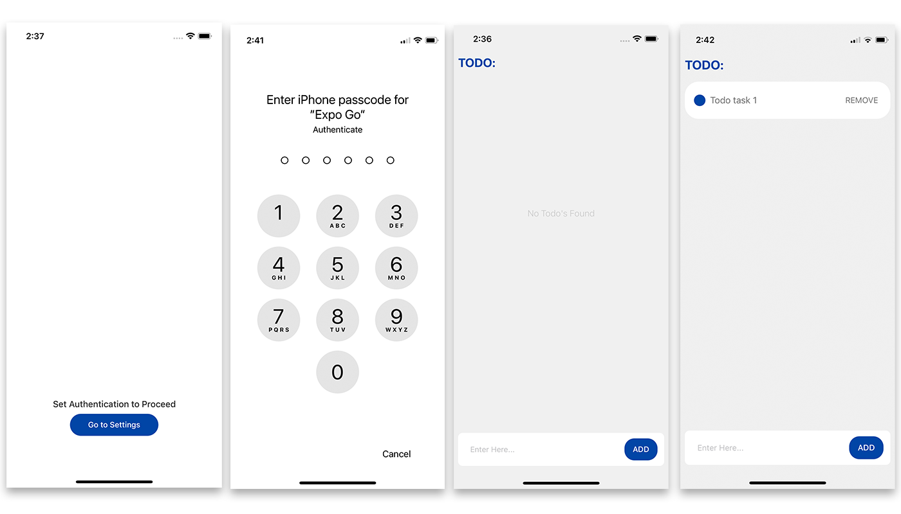
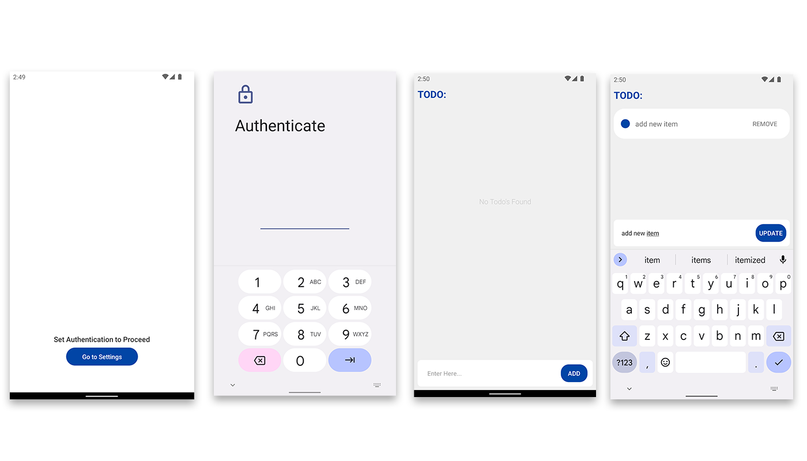

# RNTodo

### Instructions and requirements

1. Implement a secured TODO list application with a bare React Native project and Expo local-authentication module.
2. The application MUST ask for authentication before the user can add, update and delete items on the list.
3. Clean and Robust state management.
4. Adding comments explaining what code does.
5. Implement some unit tests. 

This application setup and build with latest version with react native (EXPO) [Follow this link to find more infromation](https://reactnative.dev/docs/environment-setup) 


- This project is develop and delivered with EXPO GO
- Follow the link to get documentation [Link](https://docs.expo.dev/)
- Project is tested with 
    - `Pixel_2_API_Tiramisu` Android Emulator
    - `iPhone 12` iOS simulator
    - Device support checked with `iPhone 12 Mini`, `iPhone 12` and `Samsung M2`


### Third party libraries

| library                                                               | Summary                                                                                                                                                                     |
| --------------------------------------------------------------------- | --------------------------------------------------------------------------------------------------------------------------------------------------------------------------- |
| [expo-local-authentication](https://github.com/expo/expo/tree/sdk-46/packages/expo-local-authentication)                                         | Provides an API for FaceID and TouchID (iOS) or the Fingerprint API (Android) to authenticate the user with a face or fingerprint scan..                                                                                                                                     |
| [prop-types](https://www.npmjs.com/package/prop-types)                | Runtime type checking for React props and similar objects. 
| [Jest](https://jestjs.io)                                             | Jest is a JavaScript test runner, that help you to ensure correctness of any JavaScript codebase                                                                            |
| [@testing-library/react-native](https://www.npmjs.com/package/@testing-library/react-native)                          | The React Native Testing Library (RNTL) is a lightweight solution for testing React Native components.
| [redux](https://redux.js.org/)                          | Redux is an open-source JavaScript library for managing and centralizing application state.                                   |
| [react-redux](https://react-redux.js.org)                          | React Redux is the official React UI bindings layer for Redux                                   |
| [redux-persist](https://www.npmjs.com/package/redux-persist)                          | Persist and rehydrate a redux store.                                   |

### Understanding the File Structure

```
picnic-react-native-thuyiya
│
└───src
│   └───components
│   └───constants
│   └───screens
│   └───contexts
│   └───styles
│   │   App.js
│   │
│   index.js
```

### Screenshot of running project IOS and Android

#### IOS Screenshots



#### Android Screenshots



### Functionality

- Auth Process
1. Local authentication to protect the todos
2. Keep access store untill restart the application
3. Navigate to seetings page if user did not setup any local authentication
4. Catch user cancel auth process and give option to procced

- Todo 
1. Add Todos
2. Remove Todos
3. Update todos
4. Keep todos when come back to the application again

### Test coverage
1. Snapshot for every components
2. Uniti test for check rendering
3. Mock selectors and dispatch

### Project setup instructions

- Instruction to run the project in android and ios
    1. First of all clone the project from 
    2. Then install packages using `npm install` on root of the project
    3. Starting Metro Bundler execute the  `npm start` on root of the project
        - Scan the QR code above with Expo Go (Android) or the Camera app (iOS)
        - Press a │ open Android
        - Press i │ open iOS simulator
        - Press w │ open web
        - Press r │ reload app
        - Press m │ toggle menu
        - Press ? │ show all commands
    4. Login to your expo to run it in your decvce easilay 

- Instruction for check test
    1. Execute `npm run tes` on root of the project, All the test files are under  `__tests__` folders
 
### Developer Tools And Env

- macOS Monterey (12.4)
- VSCode 1.71.0 (Universal)
- Node (v14.17.3)
- Npm (6.14.13)

##### Documented By _Thusitha Jayalath_
